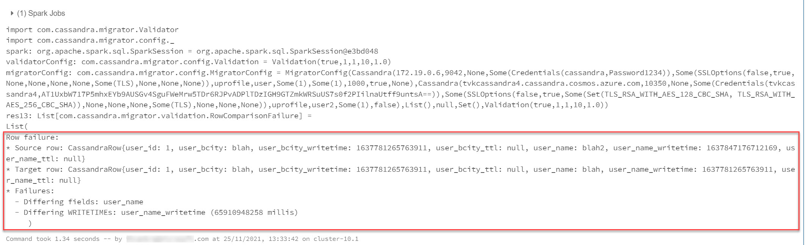

# Migrate Cassandra data with Azure Databricks

This sample allows you to migrate data between tables in Apache Cassandra using Spark with Azure Databricks, while preserving the original `writetime`. This can be useful when doing historic data loads during a [live migration](https://docs.microsoft.com/azure/managed-instance-apache-cassandra/dual-write-proxy-migration).

# Setup Azure Databricks

## Prerequisites

* [Provision an Azure Databricks cluster](https://docs.microsoft.com/azure/databricks/scenarios/quickstart-create-databricks-workspace-portal?tabs=azure-portal). Ensure it also has network access to your source and target Cassandra clusters.

* Ensure you've already migrated the keyspace/table schema from your source Cassandra database to your target Cassandra database.


## Provision a Spark cluster

Select an Azure Databricks runtime version which supports Spark 3.0 or higher.

<!-- :::image type="content" source="https://docs.microsoft.com/azure/cosmos-db/media/cassandra-migrate-cosmos-db-databricks/databricks-runtime.png" alt-text="Screenshot that shows finding the Databricks runtime version."::: -->


## Add Cassandra Migrator Spark dependencies

* Download the dependency jar [here](https://github.com/Azure-Samples/cassandra-migrator/raw/main/jar/cassandra-migrator-assembly-0.0.1.jar) * 
* Upload and install the jar on your Databricks cluster:

<!-- :::image type="content" source="./media/cassandra-migrator-jar.jpg" alt-text="Screenshot that shows searching for Maven packages in Databricks."::: -->


Select **Install**, and then restart the cluster when installation is complete.

\* You can also build the dependency jar using [SBT](https://www.scala-sbt.org/1.x/docs/Setup.html) by running `./build.sh` in the /build_files directory of this repo.

> [!NOTE]
> Make sure that you restart the Databricks cluster after the dependency jar has been installed.

## Configure Spark Connector throughput

In order to maximize throughput for large migrations, you may need to change Spark parameters at the cluster level. You can apply these settings in `advanced options` within cluster config, e.g. below. You may also want to increase the number of workers in your Spark cluster.

```config
spark.cassandra.output.batch.size.rows 1
spark.cassandra.output.concurrent.writes 500
spark.cassandra.concurrent.reads 512
spark.cassandra.output.batch.grouping.buffer.size 1000
spark.cassandra.connection.keep_alive_ms 600000000
```


# Migrate Cassandra tables

Create a new Scala notebook in Databricks with two seperate cells:

### Read Cassandra source table

In this case, we are migrating from a source cluster which does not implement SSL, to a target table which does. You can adjust `sslOptions` for your source/target tables accordingly.

```scala
import org.apache.spark.sql._

val spark = SparkSession
      .builder()
      .appName("cassandra-migrator")
      .config("spark.task.maxFailures", "1024")
      .config("spark.stage.maxConsecutiveAttempts", "60") 
      .getOrCreate

import com.cassandra.migrator.readers.Cassandra
import com.cassandra.migrator.config._
import com.datastax.spark.connector.cql.CassandraConnector;

val cassandraSource = new SourceSettings.Cassandra(
  host = "<source Cassandra host name/IP here>",
  port = 9042,
  localDC = None,
  credentials = Some(Credentials(
    username="<username here>", 
    password="<password here>")
  ),
  sslOptions = Some(SSLOptions(
    clientAuthEnabled=false,
    enabled=false,
    trustStorePassword = None,
    trustStorePath = None,
    trustStoreType = None,
    keyStorePassword = None,
    keyStorePath = None,
    keyStoreType = None,
    enabledAlgorithms = None,
    protocol = Some("TLS")
  )),  
  keyspace = "<source keyspace name>",
  table = "<source table name>",
  splitCount = Some(1), // Number of splits to use - this should be at minimum the amount of cores available in the Spark cluster, and optimally more; higher splits will lead to more fine-grained resumes. Aim for 8 * (Spark cores).
  connections = Some(1), // Number of connections to use to Cassandra when copying
  fetchSize = 1000, // Number of rows to fetch in each read
  preserveTimestamps = true, // Preserve TTLs and WRITETIMEs of cells in the source database. Note that this option is *incompatible* when copying tables with collections (lists, maps, sets).
  where = None // Optional condition to filter source table data that will be migrated, e.g. where: race_start_date = '2015-05-27' AND race_end_date = '2015-05-27'
)

val sourceDF = Cassandra.readDataframe(
  spark,
  cassandraSource,
  cassandraSource.preserveTimestamps,
  tokenRangesToSkip = Set()
)
sourceDF.dataFrame.printSchema()
```

### Migrate to Cassandra target table

```scala
import com.cassandra.migrator.writers

implicit val spark = SparkSession
      .builder()
      .appName("cassandra-migrator")
      .config("spark.task.maxFailures", "1024")
      .config("spark.stage.maxConsecutiveAttempts", "60")
      .getOrCreate

val target = new TargetSettings.Cassandra(
  host = "<target Cassandra host name/IP>",
  port = 9042,
  localDC = None,
  credentials = Some(com.cassandra.migrator.config.Credentials(
    username="<username here>", 
    password="<password here>")
  ),
  sslOptions = Some(SSLOptions(
    clientAuthEnabled=false,
    enabled=true,
    trustStorePassword = None,
    trustStorePath = None,
    trustStoreType = None,
    keyStorePassword = None,
    keyStorePath = None,
    keyStoreType = None,
    enabledAlgorithms = Some(Set("TLS_RSA_WITH_AES_128_CBC_SHA","TLS_RSA_WITH_AES_256_CBC_SHA")),
    protocol = Some("TLS")
  )),   
  keyspace = "<target keyspace name>",
  table = "<target table name>",
   connections = Some(1),
  stripTrailingZerosForDecimals = false
)

writers.Cassandra.writeDataframe(
            target,
            List(),
            sourceDF.dataFrame,
            sourceDF.timestampColumns
)
```

# Validate Migration

To validate the migration using [row comparison](https://github.com/Azure-Samples/cassandra-migrator/blob/main/build_files/src/main/scala/com/cassandra/migrator/validation/RowComparisonFailure.scala), create a third cell with the following and adjust the parameters to preferred tolerance:

```scala
import com.cassandra.migrator.Validator
import com.cassandra.migrator.config._

val spark = SparkSession
      .builder()
      .appName("cassandra-migrator")
      .config("spark.task.maxFailures", "1024")
      .config("spark.stage.maxConsecutiveAttempts", "60") 
      .getOrCreate

val validatorConfig = new Validation(
  compareTimestamps = true,
  ttlToleranceMillis = 1,
  writetimeToleranceMillis = 1,
  failuresToFetch = 10,
  floatingPointTolerance = 1.0
)

val migratorConfig = new MigratorConfig(
  cassandraSource,
  target,
  List(),
  savepoints = null,
  skipTokenRanges = Set(),
  validatorConfig
)

Validator.runValidation(migratorConfig)(spark)
```

If rows do not match, this will return something like the following output:



### SSLOptions Parameters
|Parameter|Description|Default value|
|----------|-------------|------|
|enabled  |Enable secure connection to Cassandra cluster  | false |
|trustStorePath |Path for the trust store being used    |None|
|trustStorePassword |Trust store password |None|
|trustStoreType |Trust store type |JKS|
|protocol |SSL protocol |TLS|
|enabledAlgorithms |SSL cipher suites |Set("TLS_RSA_WITH_AES_128_CBC_SHA", "TLS_RSA_WITH_AES_256_CBC_SHA")|
|clientAuthEnabled |Enable 2-way secure connection to Cassandra cluster |false|
|keyStorePath |Path for the key store being used |None|
|keyStorePassword |Key store password |None|
|keyStoreType |Key store type |JKS|
